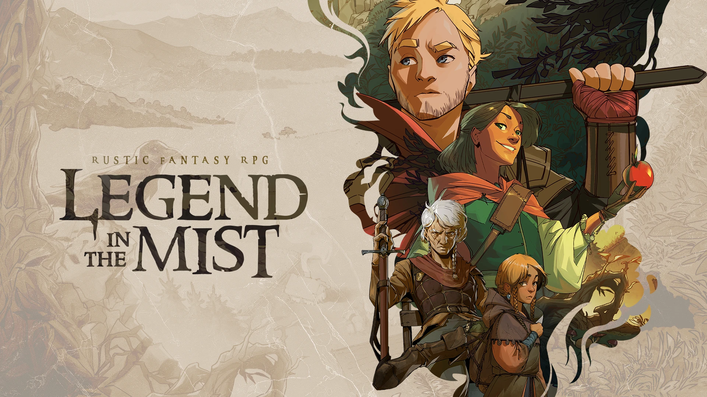

<h1 align="center">⚜️<a href="https://sonofoak.com/pages/legend-in-the-mist" rel="noreferrer" target="_blank">Legend in the Mist: Unofficial</a>⚜</h1>

<strong><em>Unofficial Community System for Foundry Virtual Tabletop</em></strong>

 

> Spin a fireside tale of villagers and other unlikely heroes setting out on a quest into a greater unknown world, rife with peril and mystery.

## Welcome to Legend in the Mist

This is an unofficial, community-made system for playing **Legend in the Mist** in Foundry Virtual Tabletop. It is not affiliated with or endorsed by Son of Oak Game Studio.

## Installation

1. Find the system called "Legend in the Mist: Unofficial" in the systems list in the setup menu.

2. Create a new world using the "Legend in the Mist: Unofficial" system.

\*_This is a fan-made project. Legend in the Mist is a game by **Son of Oak Game Studio**._

_If you feel like you could contribute something don't hesitate with contacting me @aMediocreDad._
